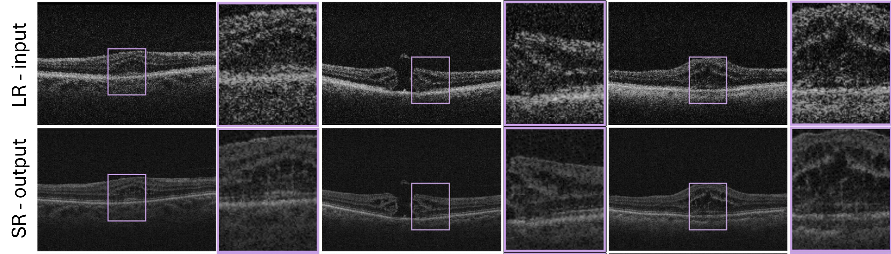

## Unpaired video super-resolution

<p align="center">

</p>

## Data 
1. Place your image sequences (number of frames > 5) under ```dataset\id\type\seq_num\```. As an example see the codeblock for
```dataset\017\UP\0011```.


   ```
       dataset/
       ├── 017/
       │ ├── DOWN/
       │ └── UP/
           ├── 0011/
             ├── im_0.png
             ├── im_1.png
             ├── im_2.png
             ├── im_3.png
             ├── im_4.png
             ├── ...
       ├── 006/
       ├── 009/
       ├── testB/
       ├── trainB/
       └── valB/
   ```

2. Modify accordingly the ```data_txts\meta_info_****.txt``` files to ensure image sequence will be read during train/val/test.
3. Place your image files for target domain under ```dataset\``` in trainB/valB/testB. 
   


## Train
Run the training script providing the configuration file, the wandb project ("project") name and username ("name"):

```
python train.py --config_file "BasicVSR_train_s.json" --wandb_project "project" --wandb_entity "name"
```

## Test
1. Download the checkpoint and place it under the ```checkpoints``` folder.
2. Run the test script: 
   ```
   python test.py --config_file "BasicVSR_test.json"
   ```


## Acknowledgments

This work relies on the following codebases and their papers:\
 https://github.com/taesungp/contrastive-unpaired-translation \
 https://github.com/ckkelvinchan/BasicVSR_PlusPlus

